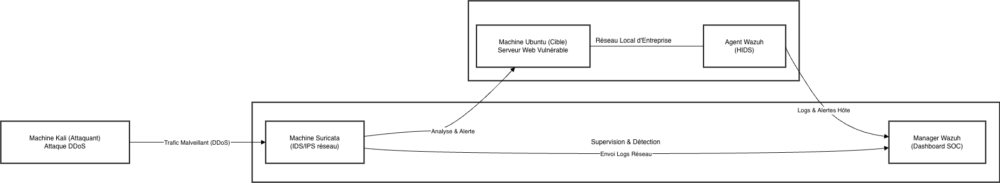

# Laboratoire de Simulation d'Attaques DDoS

## Architecture du Laboratoire

## Description du Projet
Ce projet consiste en la mise en place d'un laboratoire de simulation pour l'étude des attaques par déni de service distribué (DDoS). L'objectif est de comprendre le fonctionnement de différents vecteurs d'attaque, de les simuler dans un environnement contrôlé et d'analyser le trafic réseau résultant pour mieux appréhender les mécanismes de détection et de défense.

## Simulations Réalisées
Le laboratoire a permis de simuler plusieurs types d'attaques DDoS, dont les captures réseau et les démonstrations vidéos sont disponibles dans ce dépôt :
- **Amplification DNS** : Exploitation des serveurs DNS pour amplifier le trafic vers une cible.
- **HTTP Flood** : Envoi massif de requêtes HTTP pour saturer le serveur web.
- **ICMP Flood** : Envoi de paquets ICMP Echo Request pour saturer la bande passante et les ressources réseau.
- **Port Scanning** : Analyse des ports ouverts pour identifier les vulnérables potentielles.
- **Slowloris** : Attaque à bas débit visant à maintenir de nombreuses connexions ouvertes pour saturer le serveur web.
- **SYN Flood** : Exploitation de la poignée de main TCP pour épuiser les ressources de connexion de la cible.
- **Teardrop** : Envoi de fragments IP malformés pour provoquer un plantage de la pile TCP/IP.
- **UDP Flood** : Envoi massif de paquets UDP vers des ports aléatoires de la cible.

## Scripts de Simulation
Les scripts Python suivants ont été développés pour automatiser les simulations d'attaques :
- **[dns_amp.py](Ddos%20lab/dns_amp.py)** : Script dédié à la simulation d'attaques par amplification DNS.
- **[teardrop.py](Ddos%20lab/teardrop.py)** : Script dédié à la simulation d'attaques de type Teardrop.

## Contenu du Projet
- **Ddos lab/** : Contient les scripts de simulation (`.py`) et les captures réseau correspondantes (`.pcapng`).
- **Ddos_demonstration/** : Contient les vidéos de démonstration (`.mkv`) illustrant chaque type d'attaque simulé.
- **Documentation** : Plusieurs documents fournissent des détails supplémentaires sur le projet :
    - `NP_Guide_DDoS.pdf` : Guide technique sur les attaques DDoS.
    - `projet DDOS.docx` : Document principal du projet.
    - `présentation DDOS.pptx` : Support de présentation du laboratoire.
    - `Notes.docx` : Notes complémentaires sur les travaux réalisés.
# DDOS_Lab
# DDOS_Lab
# DDOS_Lab
